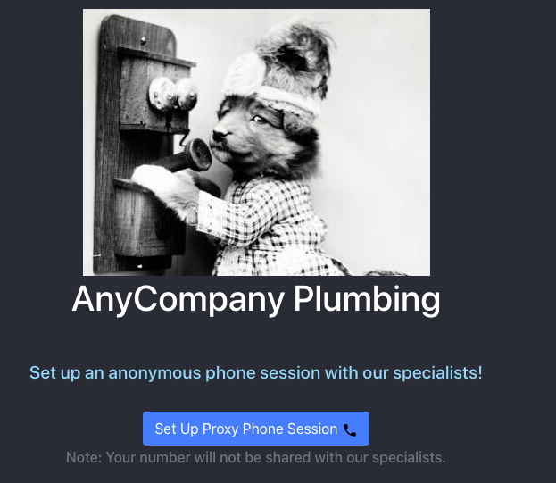

## Overview
In this sample, you will explore a use case where a plumbing company uses fake numbers to connect a customer with their plumber. You will do this by leveraging Amazon Chime's proxy phone sessions, which you can learn more about in a previous [blog post](https://aws.amazon.com/blogs/business-productivity/mask-user-phone-numbers-using-amazon-chime-proxy-phone-sessions/) about masking user phone numbers.

This repo provides an [AWS CloudFormation](https://aws.amazon.com/cloudformation/) template to set up your [Amazon Chime](https://aws.amazon.com/chime/chime-sdk/) voice connector, uses the [serverless framework](https://serverless.com) to set up a backend API for setting up proxy sessions in Amazon Chime, and provides a front-end application written in [React framework ](https://reactjs.org/) to demo this functionality.

### Pre-requisites
Set up an Amazon Chime Voice Connector in your AWS account. This repo provides an AWS CloudFormation template (`/templates/voice-connector-setup.yaml`) to set up your Amazon Chime voice connector.
1. Sign in to the [AWS Management Console](https://console.aws.amazon.com/) with your master account and switch to the US East (N. Virginia) Region. Note: The CloudFormation template in this section will need to be launched in  US East (N. Virginia) Region.
2. Download this AWS CloudFormation [template](/templates/voice-connector-setup.yaml) for setting up a voice connector.
3. Under Services, navigate to AWS CloudFormation, and choose `Create New Stack` > `With new resources (standard)`.
4. Under `Specify template`, choose the `upload a template` radio button, and upload the file you downloaded in step 2. Choose `Next`. 
4. On the `Specify Details` page, enter the following information:
    1. *Stack name* – The name of the stack for creating an Amazon Chime Voice Connector. Enter 'voice-connector-stack-01'.
    2. *Region*- The AWS region where you want to create an Amazon Chime Voice Connector. Choose between* *N. Virginia (us-east-1) or Oregon (us-west-2).
    3. *VoiceConnectorName -* Enter the name of the Amazon Chime Voice Connector to be created in this process
    4. *EnableEncryption -* Choose if you want to enable encryption for the voice connector
5. The following image shows the `Specify Details` page. 

6. Choose `Next`, and then `Next` on the `Configure stack options` page.
7. On the `Review` page, check the *I acknowledge that AWS CloudFormation might create IAM resources* checkbox, and then click `Create`.

8. Creating the stack generates 3 outputs, `VoiceConnectorName, VoiceConnectorId and OutboundHostName`, as shown in the following image. Have these values ready for the next section.


### Set up backend API using the serverless framework
This demo uses the [Serverless](https://serverless.com/) framework to deploy a simple web application in AWS. The application is served through an endpoint on [Amazon API Gateway](https://aws.amazon.com/api-gateway/), calls are made to the Amazon Chime proxy phone session APIs using [AWS Lambda](https://aws.amazon.com/lambda/), and the frontend is written using the [React framework](https://reactjs.org/).

To keep the demo simple, creation of orders happens through a simple form rather than through a customer-facing delivery flow.

1. Clone the project from GitHub.
`git clone https://github.com/aws-samples/amazon-chime-proxy-sessions-demo.git`

2. Create environment variables in your backend configuration by running the following commands. This file will contain configuration about your voice connector. 
`$ cd chimeproxy-backend`
`$ touch .env`

3. Enter the following information in the *.env* file using a text editor of your choice. Note: Refer the *env_sample* for format.
```
VOICE_CONNECTOR_ID=<Enter the AWS Chime voice connector ID created in Step 1>
USER_NUMBER=<Enter US phone number 1 to test (eg. +12052051001)> 
PROVIDER_NUMBER=<Enter US phone number 2 to test (eg. +12052051000)>
EXPIRY_MINUTES= <Enter proxy session expiry time in minutes (1-720)>
```
*Note: Make sure you enter valid US phone numbers you have access to in USER_NUMBER and PROVIDER_NUMBER. This will allow you to test the proxy sessions functionality.*

4. Deploy the serverless backend for the demo app by running the following commands.

`$ npm install`
`$ export AWS_ACCESS_KEY_ID=<your-key-here>`
`$ export AWS_SECRET_ACCESS_KEY=<your-secret-key-here>`
`$ export AWS_DEFAULT_REGION=<region-where-you-installed-voice-connector>`
`$ serverless deploy --region <region-where-you-installed-voice-connector>`

The output should look like this:


5. Copy the API Gateway endpoint URL. It should be in the following form: 
`https://********.execute-api.us-east-1.amazonaws.com/dev/`

### Run the demo app frontend
In this section, you will learn how to setup a simple web app written in the [React framework ](https://reactjs.org/) in your local environment. Once you set up this app locally, you will be able to set up a proxy calling session.

1. Create environment variables in your frontend configuration by running the following commands
`cd ../chimeproxy-frontend && touch .env`

2. You should now have an *.env* file in your chimeproxy-frontend folder. Now, you can use any code editor of your choice to enter the API Gateway URL you copied from backend section in the *.env* file. 
*Note: Refer the env_sample for format*.
`REACT_APP_API_URL=<YOUR API GW URL>`

3. Once the configuration for your frontend is entered, you can run the following commands in the chimeproxy-frontend folder to set up your frontend server locally.
`npm install`
`yarn start`

4. Open your browser and navigate to [http://localhost:3000](http://localhost:3000/) to start testing


5. Click on **Set Up Proxy Phone Session** to set up a proxy phone session between the 2 phone numbers you provided in the backend section.


## Clean up
To remove AWS resources created in your account due to this exercise, you can perform the following steps:
- Go to the AWS CloudFormation console, and delete the stack created for setting up the Amazon Chime Voice Connector
- To delete the backend resources created for this exercise, navigate to the folder where you have cloned the repository and run the following commands:
```
$ cd chimeproxy-backend
$ serverless remove --region <region-where-you-installed-voice-connector>
```


## Security

See [CONTRIBUTING](CONTRIBUTING.md#security-issue-notifications) for more information.

## License

This library is licensed under the MIT-0 License. See the LICENSE file.

